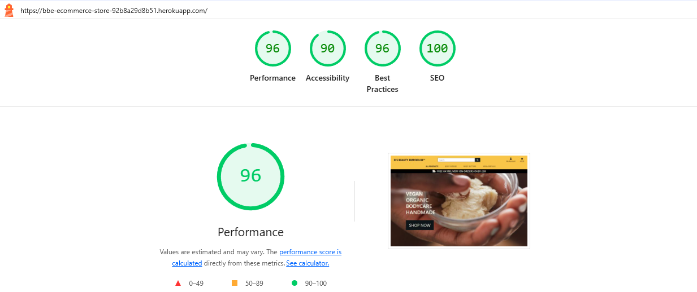

# Testing Documentation

[Automated Testing](#automated-testing)

- [Lighthouse Scores](#lighthouse-scores)
- [Running Tests](#running-tests)

[Manual Testing](#manual-testing)

### Code Validation

- **HTML Validation**: Used the [W3C HTML Validator](https://validator.w3.org/) which returned the following results:
  <div style="text-align: center; margin: 10px 0;">
      
  </div>

- **CSS Validation**: Used the [W3C CSS Validator](https://jigsaw.w3.org/css-validator/) which returned the following results:
  <div style="text-align: center; margin: 10px 0;">
      
  </div>

- **JavaScript Validation**: Used [JSHint](https://jshint.com/) to validate JavaScript code. The validation process returned a clean report compliant with ES6+ standards.


[Back to Top](#ux)

### Google Lighthouse
<br>

[Back to Top](#automated-testing)

### Automated Testing

- **Jest**: A JavaScript testing framework used for unit and integration tests.
- **Django Test Framework**: The built-in testing framework for Django applications.

### Running Tests

Make sure to include the correct versions for both JavaScript & Django testing.

JavaScript -> `package.json`

Django -> `requirements.txt`

On the terminal write the commands below:

```bash
# For javascript
npm test

# For Django
python3 manage.py test
```

#### Stripe Payment
To test Stripe payment, use the following details:
- Card number - 4242 4242 4242 4242
- CVC - any 3 digit number
- Postal Code - any 5 digit number
- Expiry date - any future date

## Manual Testing

### User Testing

<details>
    <summary>Experience</summary>
    <div style="display: flex; justify-content: center;">
        <div style="overflow-x: auto; width: 80%;">
            <table style="margin: 0 auto; border-collapse: collapse; width: 100%;">
                <tr>
                    <th>Test</th>
                    <th>Expectation</th>
                    <th>Outcome</th>
                </tr>
                <tr>
                    <td>Shopper can click a product to view full details</td>
                    <td>Pass</td>
                    <td>Pass</td>
                </tr>
                <tr>
                    <td>Shopper once logged in, can leave a product review on previous purchase</td>
                    <td>Pass</td>
                    <td>Pass</td>
                </tr>
                <tr>
                    <td>Shopper once logged in, can update a previous review</td>
                    <td>Pass</td>
                    <td>Pass</td>
                </tr>
                <tr>
                    <td>Shopper when logged in, can see product review submissions pending approval</td>
                    <td>Pass</td>
                    <td>Pass</td>
                </tr>
                <tr>
                    <td>Shopper when logged in, can submit a newsletter subscription</td>
                    <td>Pass</td>
                    <td>Pass</td>
                </tr>
                <tr>
                    <td>Shopper if not logged in, and has no previous purchase, cannot leave a product review</td>
                    <td>Pass</td>
                    <td>Pass</td>
                </tr>
                <tr>
                    <td>Shopper is redirected to Product page if login or signup is from another page</td>
                    <td>Pass</td>
                    <td>Pass</td>
                </tr>
                <tr>
                    <td>Shopper receives link to validate email address and confirm wish to signup to website</td>
                    <td>Pass</td>
                    <td>Pass</td>
                </tr>
                <tr>
                    <td>Shopper receives message to confirm status of all activities on site</td>
                    <td>Pass</td>
                    <td>Pass</td>
                </tr>
            </table>
        </div>
    </div>
</details>

<details>
    <summary>Navigation</summary>
    <div style="display: flex; justify-content: center;">
        <div style="overflow-x: auto; width: 80%;">
            <table style="margin: 0 auto; border-collapse: collapse; width: 100%;">
                <tr>
                    <th>Test</th>
                    <th>Expectation</th>
                    <th>Outcome</th>
                </tr>
                <tr>
                    <td>Shopper can view product and details without signing in</td>
                    <td>Pass</td>
                    <th>Pass</th>
                </tr>
                <tr>
                    <td>Navigation links lead to their intended pages</td>
                    <td>Pass</td>
                    <th>Pass</th>
                </tr>
                <tr>
                    <td>Shopper is made aware via navigation links where they are on the website</td>
                    <td>Pass</td>
                    <th>Pass</th>
                </tr>
                <tr>
                    <td>Shopper can signup for an account to keep track of past purchases</td>
                    <td>Pass</td>
                    <th>Pass</th>
                </tr>
                <tr>
                    <td>Shopper can navigate to Home Page at any time by clicking Logo or Home </td>
                    <td>Pass</td>
                    <th>Pass</th>
                </tr>
            </table>
        </div>
    </div>
</details>

<details>
    <summary>Signing Up</summary>
    <div style="display: flex; justify-content: center;">
        <div style="overflow-x: auto; width: 80%;">
            <table style="margin: 0 auto; border-collapse: collapse; width: 100%;">
                <tr>
                    <th>Test</th>
                    <th>Expectation</th>
                    <th>Outcome</th>
                </tr>
                <tr>
                    <td>Shopper can create an account on the website</td>
                    <td>Pass</td>
                    <th>Pass</th>
                </tr>
                <tr>
                    <td>Shopper can login to existing account</td>
                    <td>Pass</td>
                    <th>Pass</th>
                </tr>
                <tr>
                    <td>Shopper can successfully request password reset</td>
                    <td>Pass</td>
                    <th>Pass</th>
                </tr>
                <tr>
                    <td>Shopper is informed once account has successfully been created</td>
                    <td>Pass</td>
                    <th>Pass</th>
                </tr>
                <tr>
                    <td>Shopper can view past purchases under 'My Account'</td>
                    <td>Pass</td>
                    <th>Pass</th>
                </tr>
            </table>
        </div>
    </div>
</details>

<details>
    <summary>Responsiveness</summary>
    <div style="display: flex; justify-content: center;">
        <div style="overflow-x: auto; width: 80%;">
            <table style="margin: 0 auto; border-collapse: collapse; width: 100%;">
                <tr>
                    <th>Test</th>
                    <th>Expectation</th>
                    <th>Outcome</th>
                </tr>
                <tr>
                    <td>Home, signup, login, profile and product pages display correctly on mobiles and tablets (769px and lower)</td>
                    <td>Pass</td>
                    <td>Pass</td>
                </tr>
                <tr>
                    <td>Home, signup, login, profile and product pages display correctly on laptops and desktops (992px and higher - up to 1200px)</td>
                    <td>Pass</td>
                    <td>Pass</td>
                </tr>
                <tr>
                    <td>Content is layered when viewed on smaller devices</td>
                    <td>Pass</td>
                    <td>Pass</td>
                </tr>
                <tr>
                    <td>Username displayed in shortened on smaller devices</td>
                    <td>Pass</td>
                    <td>Pass</td>
                </tr>
            </table>
        </div>
    </div>
</details>

<details>
    <summary>Authentication</summary>
    <div style="display: flex; justify-content: center;">
        <div style="overflow-x: auto; width: 80%;">
            <table style="margin: 0 auto; border-collapse: collapse; width: 100%;">
                <tr>
                    <th>Test</th>
                    <th>Expectation</th>
                    <th>Outcome</th>
                </tr>
                <tr>
                    <td>Shopper can create an account on website</td>
                    <td>Pass</td>
                    <th>Pass</th>
                </tr>
                <tr>
                    <td>Shopper is sent link to validate email when attempting to create an account on website</td>
                    <td>Pass</td>
                    <th>Pass</th>
                </tr>
                <tr>
                    <td>Shopper can login to existing account</td>
                    <td>Pass</td>
                    <th>Pass</th>
                </tr>
                <tr>
                    <td>Shopper is informed once account has successfully been created</td>
                    <td>Pass</td>
                    <th>Pass</th>
                </tr>
                <tr>
                    <td>Shopper is unable to leave review on unauthorised purchase</td>
                    <td>Pass</td>
                    <th>Pass</th>
                </tr>
                <tr>
                    <td>Shopper is able to leave review on authorised purchase</td>
                    <td>Pass</td>
                    <th>Pass</th>
                </tr>
                <tr>
                    <td>Shopper can see authorised reviews of previous purchases</td>
                    <td>Pass</td>
                    <th>Pass</th>
                </tr>
                <tr>
                    <td>Shopper can see pending reviews of previous purchases</td>
                    <td>Pass</td>
                    <th>Pass</th>
                </tr>
            </table>
        </div>
    </div>
</details>